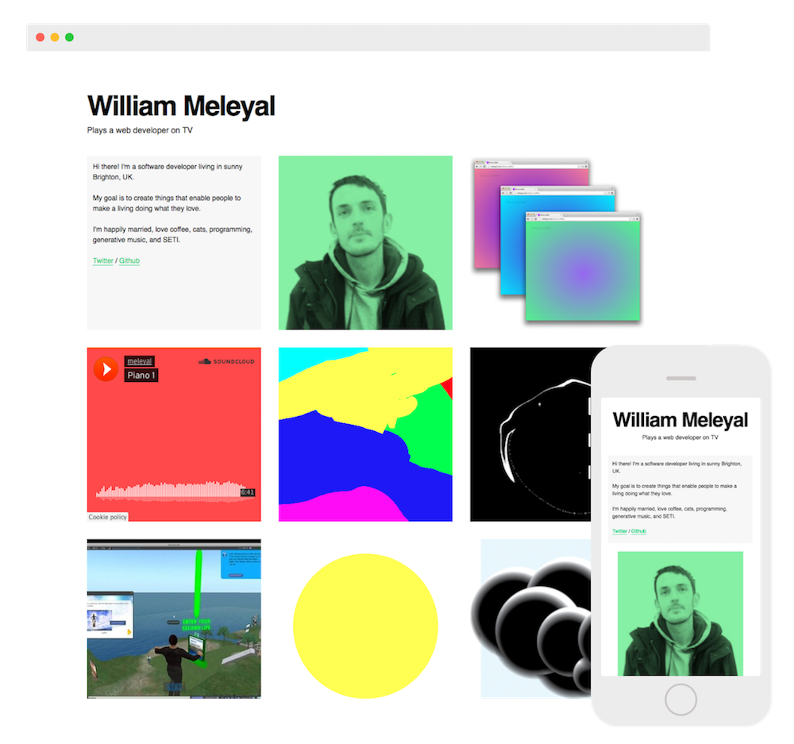

# Upsite

Upsite is a multi-tenant minimal website builder made with Ruby on Rails. It makes sites like this:

## History

This was a long-time pet project that was online for around 1 year. Ultimately I couldn't pay the bills with it so I decided to discontinue the web service and open source the code.

* Sep 2012 - First [commit](2d663f7)
* Jun 2016 – Launched at [www.upsite.io](https://www.upsite.io/)
* Nov 2016 – Featured on [Product Hunt](https://www.producthunt.com/posts/upsite-markdown)
* Jun 2017 – Discontinued and [open sourced](https://github.com/meleyal/upsite/)
